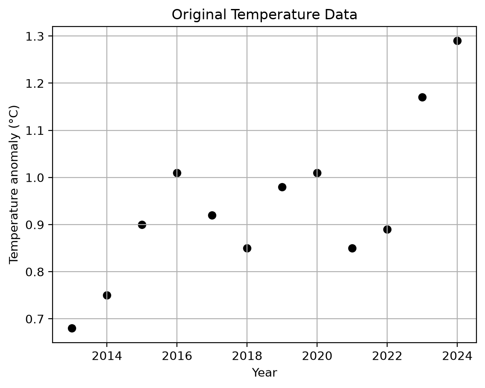
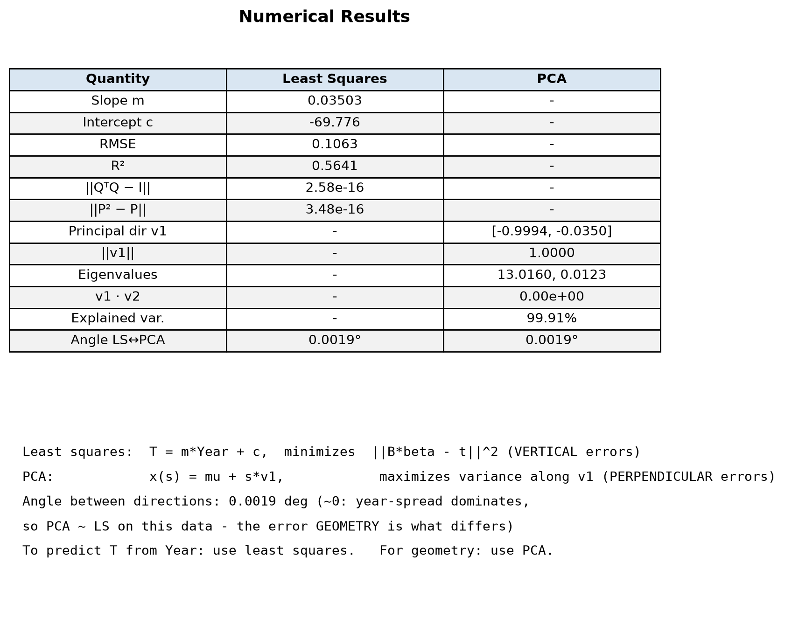
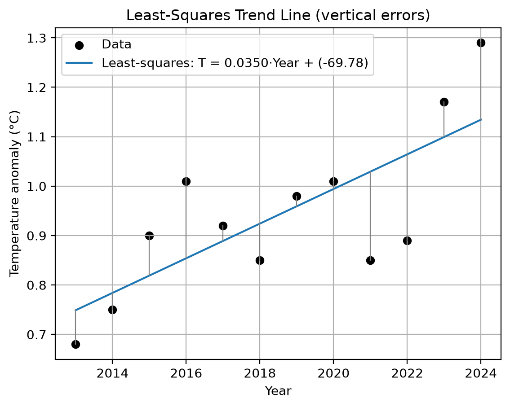
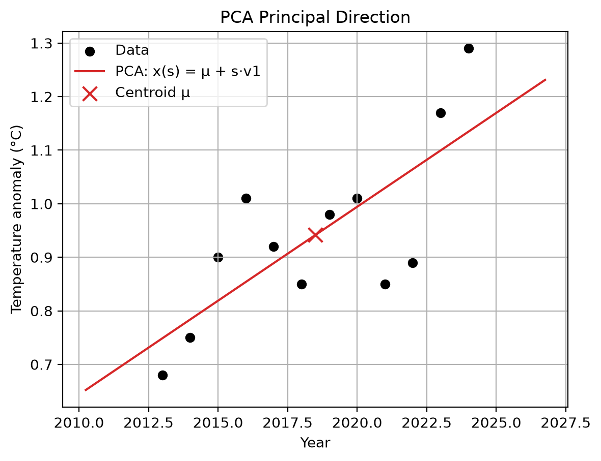
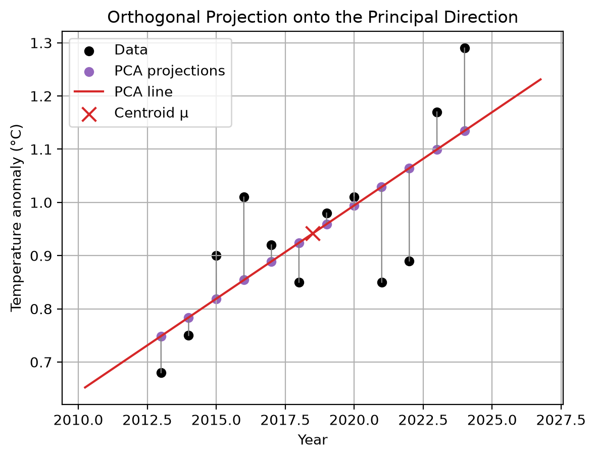
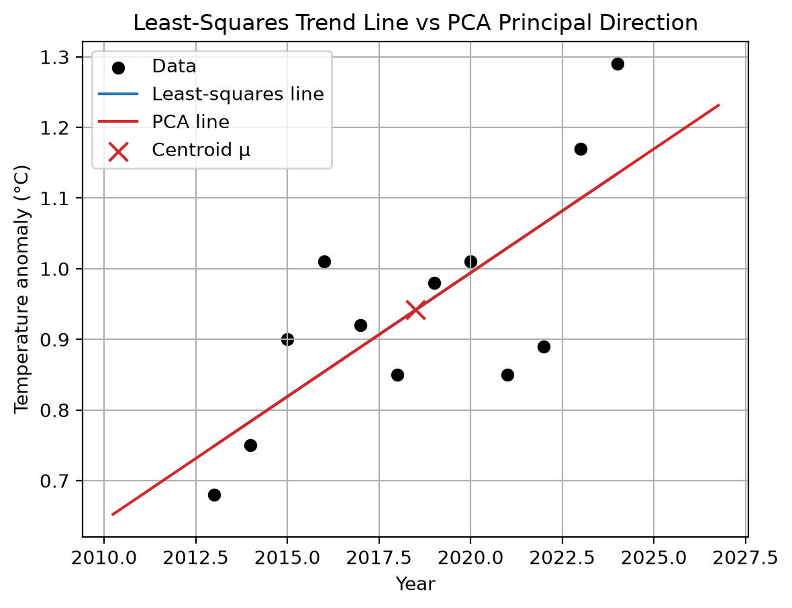

# Two Lines Through Temperature Data - Least-Squares Trend Lines and PCA Principal Directions on Climate Data

**Project Members**

| Name | SRN |
|---|---|
| Prajwal M M | PES1UG25CS370 |
| Navneeth Suresh | PES1UG25CS326 |
| Nikhil Reddy | PES1UG25CS340 |
| Nikhil Kiran | PES1UG25CS338 |

## 1. Problem Statement

> “Plot a small set of year-temperature points; fit a least-squares trend line
> and find a principal direction using PCA. Compare what the lines represent.”

This combines the ideas of Project 8 (interpolation and climate change, via the
orthogonal-projection least-squares method) and Project 11 (projections,
eigenvectors, and PCA).

## 2. Objective

To compute two different "best" lines through the same 2D data and to
understand, from first principles, why they answer different questions.

## 3. Dataset

A 12-year subset (2013-2024) of the annual global-mean land-ocean
temperature anomaly from the NASA GISTEMP v4 analysis (deviations from the
1951-1980 mean, in °C). 
Source: `https://data.giss.nasa.gov/gistemp/tabledata_v4/GLB.Ts+dSST.csv` (year
column, `J-D` annual mean). The points are not perfectly collinear, so both
the least-squares fit and the PCA direction are meaningful.

## 4. Matrix Representation

Data matrix - each row is one observation `(year, temperature)`:

```
X = [[year_1, temp_1],
     [year_2, temp_2],
     ...
     [year_n, temp_n]]
```

Design matrix and target vector for the linear model `temp ≈ c + m·year`:

```
B = [[1, year_1], [1, year_2], ..., [1, year_n]]   (n × 2)
t = [temp_1, ..., temp_n]^T                        (n × 1)
```

The system `B β ≈ t` with `β = [c, m]^T` is generally inconsistent, which is
exactly why we need least squares.

## 5. Least Squares

We solve

```
min_β  || B β − t ||²
```

Geometric (Project 8) interpretation - the fitted values `t_hat` are the
orthogonal projection of `t` onto the column space of `B`:

1. `Q = orth(B)` - orthonormal basis for `col(B)`. `Q^T Q ≈ I`.
2. `P = Q Q^T` - orthogonal projection matrix. `P² ≈ P` (idempotent) and
   `P^T = P` (symmetric).
3. `t_hat = P t` - projection of the temperature vector onto `col(B)`.

Since `t_hat ∈ col(B)`, there is a `β = [c, m]^T` with `Bβ = t_hat`. We extract
it with `np.linalg.lstsq(B, t, rcond=None)`. The line is then

```
temperature ≈ m·year + c
```

Residuals are vertical in the plot; SSE/RMSE/R² are computed from them.

## 6. PCA

1. Center the data: `Z = X − μ`, where `μ = mean of each column`.
2. Covariance matrix: `C = (1/(n−1)) Zᵀ Z` (2×2, symmetric).
3. Eigenpairs of `C` from `np.linalg.eigh(C)` (symmetric, so real eigenpairs;
   eigenvectors orthogonal).
4. Sort by eigenvalue, descending. `λ₁` largest → `v₁` is the principal
   direction; `||v₁|| ≈ 1` and `v₁·v₂ ≈ 0`.
5. PCA line: `x(s) = μ + s·v₁`, passing through the centroid.
6. Each centered point projects as `(zᵢ·v₁)v₁`; translating back gives the
   foot-of-perpendicular points on the PCA line.

Explained variance ratio: `λ₁/(λ₁+λ₂)` - the fraction of total 2D variance
lying along `v₁`.

## 7. Results

Running the script shows (values recomputed, not hard-coded):

- a "Numerical Results" figure with the Q, P checks
  (`||QᵀQ - I||`, `||P² - P||`), slope, intercept, equation, SSE, RMSE, R²,
- covariance matrix eigensystem: eigenvalues, principal direction v1,
  `||v1||`, `v1·v2`, explained variance ratio, angle between directions.

### Figures

| | | |
|---|---|---|
| **1. Original Data**<br> | **2. Numerical Results**<br> | **3. Least Squares**<br> |
| **4. PCA Direction**<br> | **5. PCA Projections**<br> | **6. Comparison**<br> |

## 8. Comparison

| Aspect | Least squares | PCA |
|---|---|---|
| Question | Best predict `T` from `year` | Direction of maximum variance |
| Error minimized | Vertical (squared) | Perpendicular (reconstruction) |
| Variables | Asymmetric (`year` in, `T` out) | Symmetric |
| Line passes through | The centroid (x̄, ȳ) | Always the centroid μ |
| Use for | Prediction, trend | Geometry, dimensionality reduction |

The two directions make only a small angle with each other when the data is
approximately linear along a well-defined trend, but they coincide only
accidentally - they are obtained from different optimization problems. With
raw units, the Year spread dominates the covariance matrix, so the two
fitted slopes nearly coincide (angle ≈ 0° on the GISTEMP subset). The
conceptual difference is visible in the error geometry: vertical residual
segments for least squares vs perpendicular projection segments for PCA.
If Year and Temperature were standardized to comparable scales, the two
lines would rotate apart visibly.

## 9. Conclusion

Least squares draws the line of best *prediction*; PCA draws the line of best
*description* of the cloud. Both are pure linear algebra: orthogonal projection
onto a column space, and eigenvectors of a covariance matrix.

## 10. How to Run

Dependencies: `numpy`, `scipy`, `matplotlib` (managed by `uv`).

```bash
uv sync
uv run minimfad
```

The script opens six labelled matplotlib windows; there is intentionally no
terminal output.

## 11. License

Released under the [MIT License](LICENSE).
